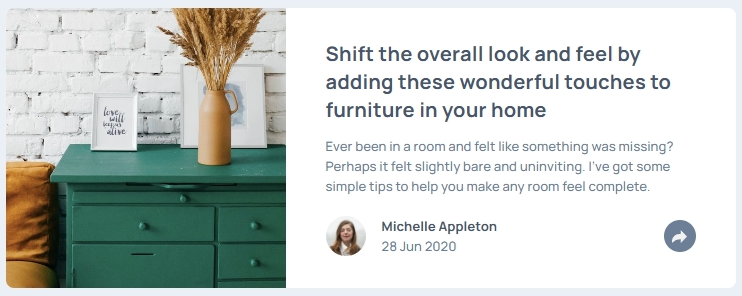
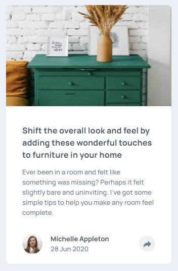

# Frontend Mentor - Article preview component solution

This is a solution to the [Article preview component challenge on Frontend Mentor](https://www.frontendmentor.io/challenges/article-preview-component-dYBN_pYFT). Frontend Mentor challenges help you improve your coding skills by building realistic projects. 

## Table of contents

- [Overview](#overview)
  - [The challenge](#the-challenge)
  - [Screenshot](#screenshot)
  - [Links](#links)
- [My process](#my-process)
  - [Built with](#built-with)
  - [What I learned](#what-i-learned)
  - [Continued development](#continued-development)
  - [Useful resources](#useful-resources)
- [Author](#author)

**Note: Delete this note and update the table of contents based on what sections you keep.**

## Overview
Create an article preview card with an interactive button using HTML, CSS and JS.

### The challenge

Users should be able to:

- View the optimal layout for the component depending on their device's screen size
- See the social media share links when they click the share icon

### Screenshot




### Links

- Solution URL: [Github Solution Page](https://github.com/cacesasa/article_preview_component)
- Live Site URL: [Github Pages Live URL](https://your-live-site-url.com)

## My process

### Built with

- Semantic HTML5 markup
- CSS custom properties
- Flexbox
- CSS Grid
- Mobile-first workflow
- JavaScript DOM manipulation

### What I learned

I learned the use of JS to manipulte the DOM as well as how to create an interactive button, as well as the use of the popover HTML property. 

```css
:popover-open {
        display: flex;
        background: var(--clr-very-dark-grayish-blue);
        width: 15.5rem;
        padding: 1.125rem 2.25rem;
        border-radius: 0.5rem;
        border: 0;        
        gap: 1rem;
        align-items: center;
        overflow: visible;
    }

[popover]::after {
    content: '';
    height: 0;
    width: 0;
    border-top: 0.75rem solid var(--clr-very-dark-grayish-blue);
    border-right: 0.75rem solid transparent;
    border-bottom: 0.75rem solid transparent;
    border-left: 0.75rem solid transparent;
    position: absolute;
    left: 50%;
    top: 100%;
    margin-left: -0.75rem;
  }
```

### Continued development

Continue to develop my JS skills, like DOM manipulation to be able to create a more interactive design.

### Useful resources

- [Introducing the CSS anchor positioning API](https://developer.chrome.com/blog/anchor-positioning-api#use_anchor_with_top-layer_elements_like_popover_and_dialog) - This webside has a very good explanation of the CSS anchor positioning API.

## Author

- Frontend Mentor - [@cacesasa](https://www.frontendmentor.io/profile/cacesasa)
- Twitter - [@cacesasa](https://www.twitter.com/cacesasa)

